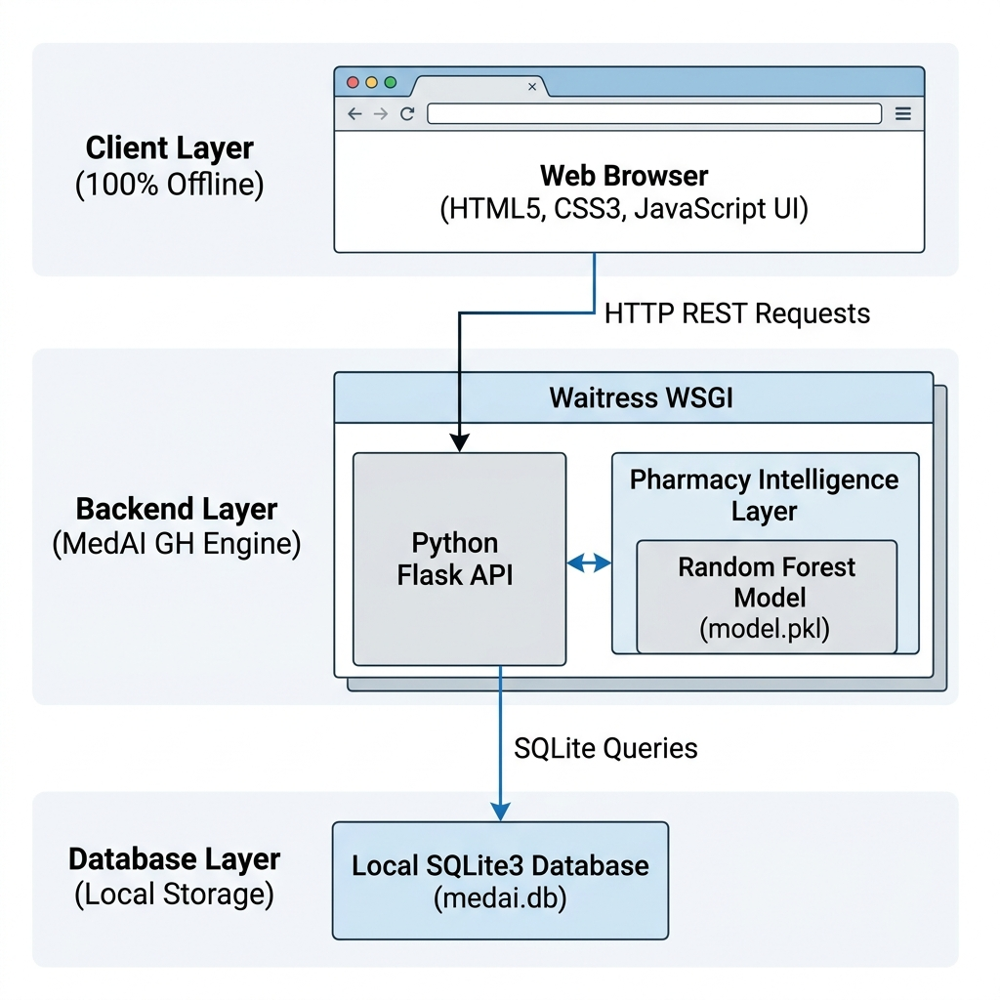
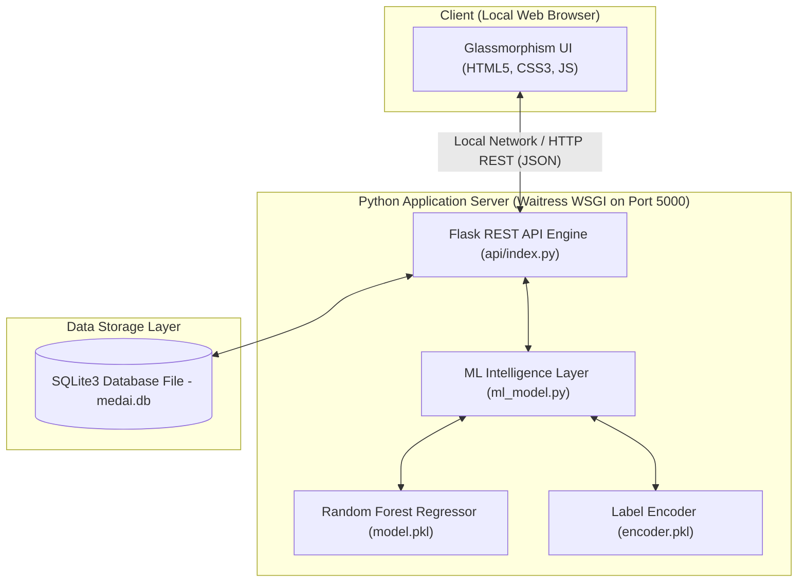
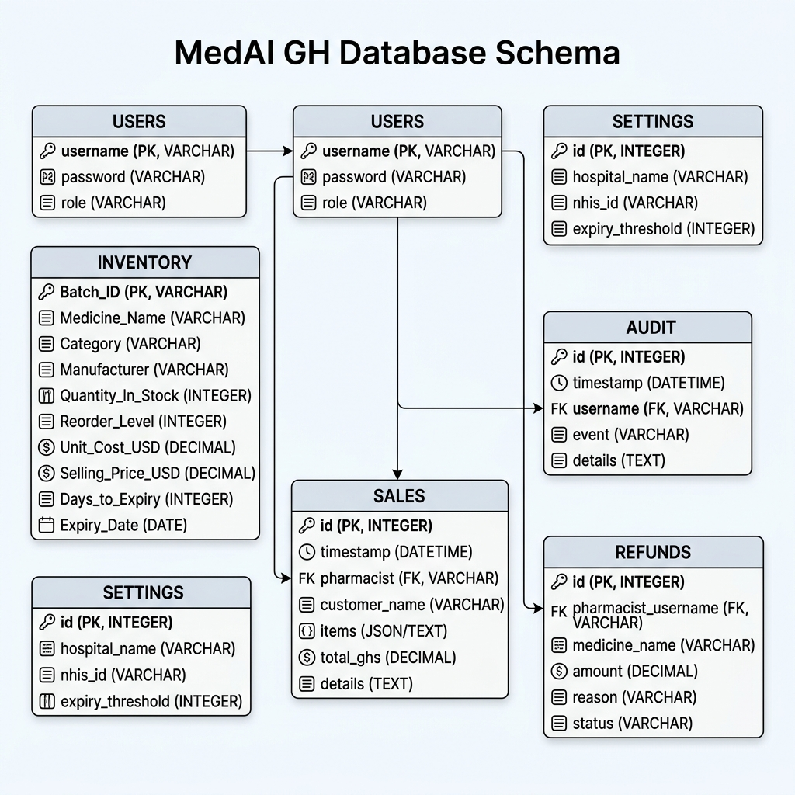
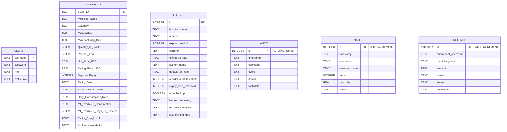
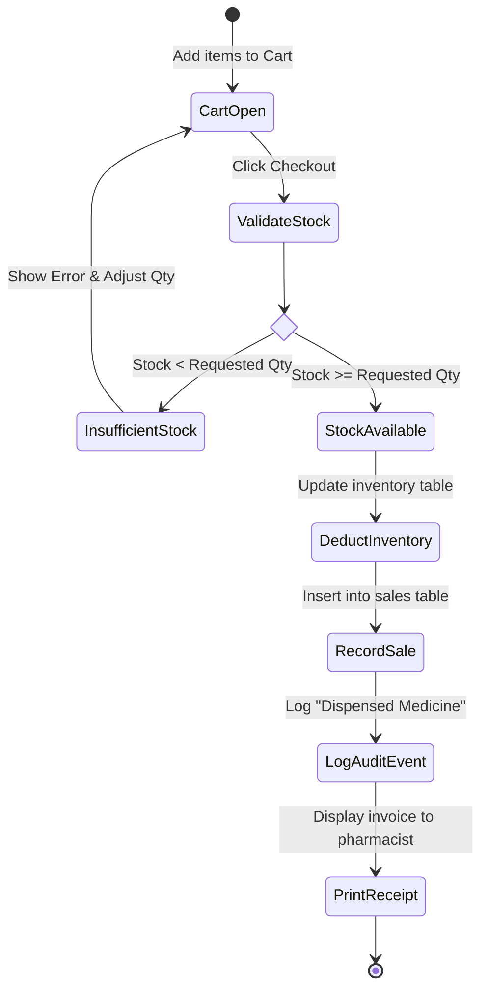
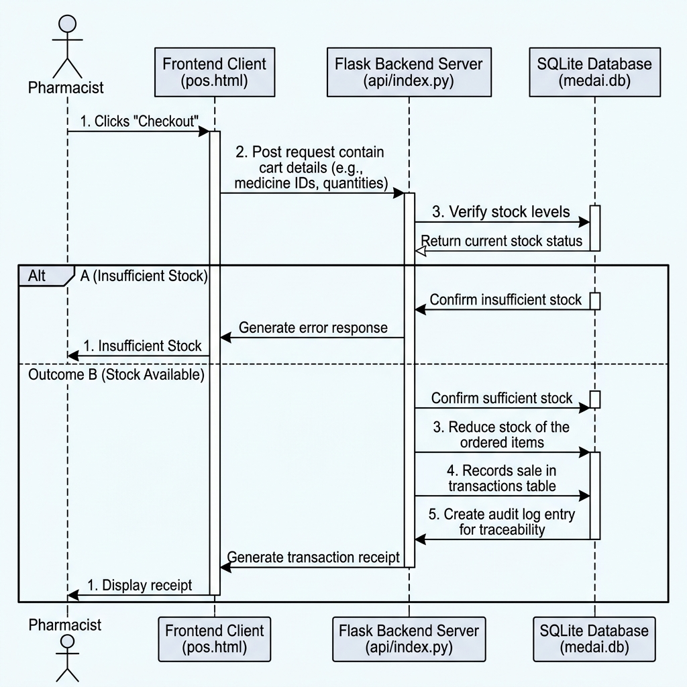
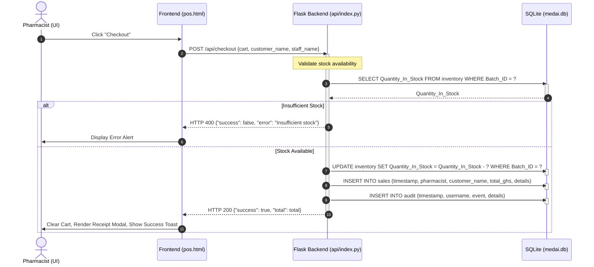
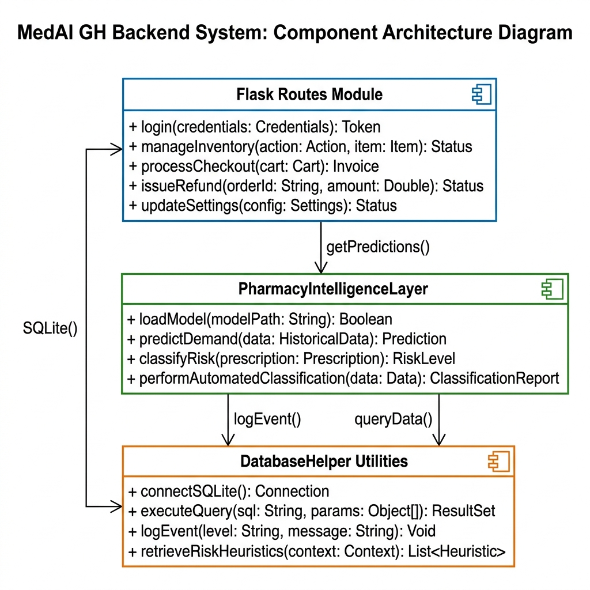
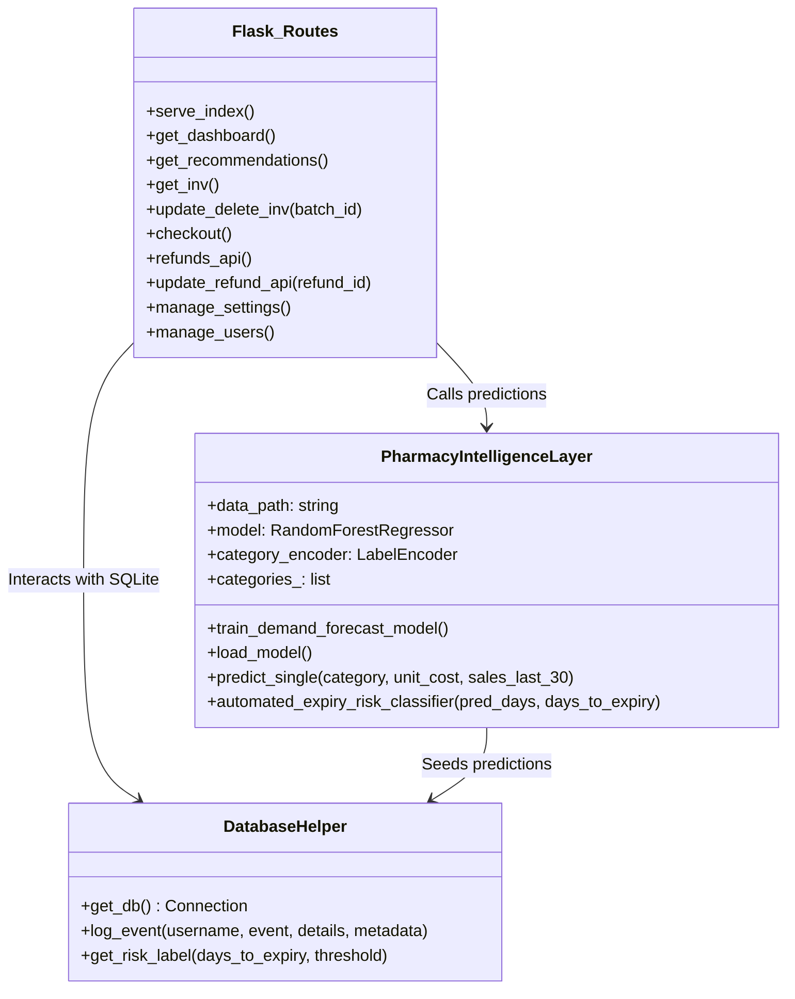
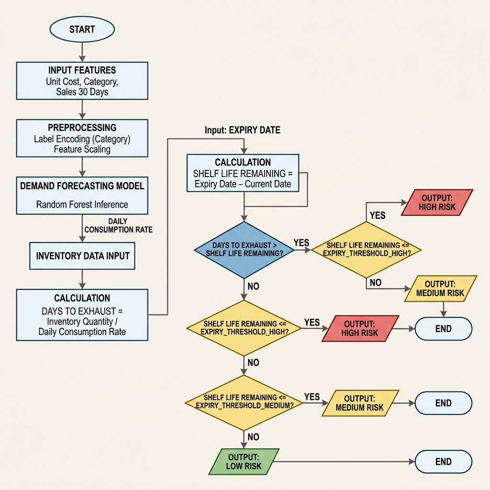

# Chapter 3: Methodology and System Design

This chapter explains the research methodology, requirement analysis, tools, and system development processes utilized in building the **MedAI GH** Pharmacy Inventory Management System. It outlines the visual models, architectural design, database schematics, algorithmic flowcharts, data processing steps, verification procedures, and ethical guidelines governing the platform.

---

## 3.1 Research Methodology

### 3.1.1 Research Approach
This project adopts the **Design Science Research (DSR)** framework. DSR focuses on the creation and evaluation of innovative IT artifacts (software systems, machine learning models, database structures) to solve identified organizational problems. In this case, the artifact addresses high operational risks in healthcare clinics—specifically, medicine stockouts and financial waste from drug expiry. 

The approach combines:
1. **Quantitative Modeling**: Analyzing historical sales and inventory statistics to generate demand forecasts.
2. **Empirical Evaluation**: Validating the efficiency of the local system through stress tests and simulated multi-user checkout scenarios.

### 3.1.2 Data Collection Methods
The system was designed and seeded using a curated dataset of over 500 medicine records (`project dataset.csv`) that simulates typical inventory in Ghanaian public healthcare clinics.
* **Secondary Data**: Historical sales volumes, manufacturing and expiry dates, category names, unit costs, and quantity distributions were compiled from pharmacy inventory profiles.
* **Expert Consultation**: Operational logic (such as the standard 30-day default threshold for critical alerts, NHIS integration requirements, and refund approval workflows) was formulated based on pharmacist interviews regarding clinical workflows in Ghanaian hospital dispensaries.

### 3.1.3 System Development Methodology
This system was built using the **Agile Development Methodology (Scrum)**. The iterative approach was selected because of the need to adapt database and network paradigms during the development lifecycle (such as migrating from cloud-dependent engines to a 100% offline, air-gapped system to address local power and internet outages). 

```
┌─────────────────────────────────────────────────────────┐
│              A G I L E   I T E R A T I O N S            │
├───────────────┬─────────────────┬───────────────────────┤
│    Sprint 1   │ Database Schema & SQLite Setup          │
│    Sprint 2   │ Python Flask API & POS Cart Logic       │
│    Sprint 3   │ Random Forest Model & Forecast Engine   │
│    Sprint 4   │ Glassmorphism Web Interface Design      │
│    Sprint 5   │ Integration Testing & Local Deployment  │
└───────────────┴─────────────────┴───────────────────────┘
```

---

## 3.2 Requirements Analysis

### 3.2.1 Functional Requirements
Functional requirements define the core behaviors and tasks the system must execute:

1. **User Authentication & Role-Based Access Control (RBAC)**:
   * Secure, local credential validation for two distinct user categories: `admin` and `pharmacist`.
   * Dynamic interface rendering depending on the authenticated role (e.g., pharmacists are restricted from financial reports).

2. **Real-time Inventory Tracking**:
   * Interactive searching, batch tracking (Batch ID, Manufacturer, Expiry Date), and inventory level monitoring.
   * Auto-reorder indicator systems triggered when stock levels dip below configured thresholds.

3. **Intelligent Demand Forecasting & Expiry Classification**:
   * Automated execution of a local Machine Learning regressor to calculate a daily consumption rate.
   * Dynamic calculation of the stockout date ("Days to Exhaust").
   * Risk classification matching consumption trends with physical expiry dates (`High Risk`, `Medium Risk`, `Low Risk`).

4. **Point-of-Sale (POS) & Dispensing Terminal**:
   * Interactive shopping cart allowing pharmacists to select drugs, validate quantity against live database records, log customer names, and process payments.

5. **Refund Review Workflow**:
   * Pharmacists can submit a refund request for specific quantities against recent sales.
   * Administrators must review, approve, or reject requests to modify the financial trail and restore stock.

6. **System Customization & Auditing**:
   * Configurable options for hospital names, NHIS identification, local currency settings, and risk alert thresholds.
   * An immutable, time-stamped log tracing all actions (logins, logouts, transactions, and inventory changes) for regulatory compliance.

### 3.2.2 Non-Functional Requirements
Non-functional requirements specify operational constraints and quality attributes:

1. **Offline Autonomy & Air-Gapped Resiliency**:
   * The platform must operate with zero internet dependency. All assets, fonts, icons, libraries, database engines, and ML runtimes must load directly from the local host machine.

2. **Performance & Concurrency**:
   * The system must handle simultaneous requests from multiple local nodes using a multi-threaded server. API endpoints must return query results within milliseconds.

3. **Data Integrity & Robust Self-Healing**:
   * Prevention of database corruption during unexpected system power-offs.
   * Automatic validation of the database state upon server startup, with quick recovery routines to initialize missing components or configurations.

4. **Security & Auditability**:
   * Local verification mechanisms preventing elevation of privileges.
   * Immutable logging where transaction data cannot be modified or deleted without leaving an audit footprint.

5. **Usability**:
   * A responsive, high-contrast user interface matching standard medical display formats.
   * Clean visualization of alerts using color-coded systems (Red for high risk, Amber for medium, Blue/Green for safe).

### 3.2.3 User Stories
* **As a Pharmacist**, I want to scan or search for a medicine and see its live stock status, so that I do not dispense unavailable medicines.
* **As a Pharmacist**, I want to submit a refund request for an incorrect sale, so that the administrator can approve the stock correction and update the revenue ledger.
* **As a Clinic Administrator**, I want to look at the predictive forecasting dashboard, so that I can know which critical drugs are going to expire or run out of stock in the next month.
* **As a Clinic Administrator**, I want to view the system audit logs, so that I can verify all transactions made during the day and track which user performed them.

---

## 3.3 Tools and Technologies Used

The technology stack is designed to be lightweight, cross-platform, and fully operational without remote servers or cloud environments:

| Technology Category | Tool Selected | Rationale |
| :--- | :--- | :--- |
| **Backend Language** | Python 3.9+ | Provides native, high-performance environments for machine learning inference and database integrations. |
| **Backend Framework** | Flask | A lightweight, un-opinionated WSGI micro-framework ideal for embedding microservices and hosting local API routes. |
| **Frontend Stack** | HTML5, CSS3, Vanilla JS | Optimizes performance and prevents framework overhead, running natively in any standard local browser. |
| **Database Engine** | SQLite3 | An embedded, serverless, self-contained SQL database engine that stores all data in a single local file, eliminating server configuration. |
| **Machine Learning Engine** | Scikit-Learn | Provides standard implementation for the Random Forest Regressor, with optimized math routines for fast inference. |
| **Data Manipulation** | Pandas & NumPy | Facilitates structured handling of data frames during dataset parsing and training phases. |
| **Model Serialization** | Joblib | Enables fast saving and loading of pre-trained models and label encoders to disk, speeding up application boot time. |
| **Production WSGI Server** | Waitress | A production-quality, multi-threaded pure-Python WSGI server that ensures system stability for local area network clients. |
| **UI Components** | FontAwesome & Chart.js | Bundled locally (stored in `public/vendor/`) to enable rich iconography and dynamic analytics charts without external CDNs. |

---

## 3.4 System Design

The architectural design documents how components communicate, the databases are structured, and workflows are executed:

### 3.4.1 System Architecture Diagram
The architecture is structured as a local client-server pattern. The client requests pages and submits REST transactions to the Flask API wrapper, which queries the SQLite file and communicates with the serialized Random Forest model in local RAM.





### 3.4.2 Use Case Diagram
This diagram describes user access privileges and system interactions:

```mermaid
left_to_right_direction
actor Admin as "System Administrator"
actor Pharmacist as "Dispensing Pharmacist"

rectangle MedAI_GH_System {
    usecase UC1 as "Login / Session Management"
    usecase UC2 as "Manage Staff Accounts"
    usecase UC3 as "Configure System Settings"
    usecase UC4 as "View Full Audit Logs"
    usecase UC5 as "Approve / Reject Refunds"
    usecase UC6 as "View Sales Reports & Charts"
    usecase UC7 as "Search Live Inventory"
    usecase UC8 as "Dispense Medicine (POS Checkout)"
    usecase UC9 as "Request Transaction Refund"
    usecase UC10 as "View Personal Sales Records"
}

Admin --> UC1
Admin --> UC2
Admin --> UC3
Admin --> UC4
Admin --> UC5
Admin --> UC6
Admin --> UC7

Pharmacist --> UC1
Pharmacist --> UC7
Pharmacist --> UC8
Pharmacist --> UC9
Pharmacist --> UC10
```

### 3.4.3 Database Design (ERD)
The database structure is normalized using relational tables stored inside the embedded `medai.db` SQLite database:





### 3.4.4 Activity Diagram: POS Checkout Flow
The operational steps taken when a pharmacist conducts a sale through the checkout interface:



### 3.4.5 Sequence Diagram: Medicine Dispensing Transactions
This diagram illustrates the message passing sequence across the front-end interface, Flask controller backend, and SQLite persistence layer during checkout:





### 3.4.6 Class and Structure Diagram
The OOP layout of the Python backend scripts shows the routing logic, the database utility functions, and the machine learning interface:





---

## 3.5 Algorithm / Model Description

The system employs hybrid intelligence: machine learning for consumption modeling and mathematical heuristics for clinical risk classifications.

### 3.5.1 Demand Forecasting (Random Forest Regressor)
The demand forecasting system is powered by a **Random Forest Regressor**, which is an ensemble learning method that trains multiple decision trees and averages their predictions to reduce overfitting and variance.



#### Mathematical Foundation
For a given input vector $x$ containing features $x = [x_1, x_2, x_3]$:
$$x_1 = \text{Unit Cost (USD)}, \quad x_2 = \text{Category Encoded (Label Encoded Integer)}, \quad x_3 = \text{Historical Sales Last 30 Days}$$

The Random Forest regressor comprises $B$ independent decision trees. Each tree $T_b$ makes a prediction $\hat{y}_b = T_b(x)$. The final predicted daily consumption rate $\hat{y}$ is the average of all trees:
$$\hat{y} = \frac{1}{B} \sum_{b=1}^{B} T_b(x)$$
Here, $B = 100$ (representing 100 estimators), ensuring highly stable forecasts that capture complex, non-linear correlations.

#### Pseudocode: Forecasting and Stockout Prediction
```python
ALGORITHM PredictDailyConsumptionAndStockout(medicine_record)
    INPUT: medicine_record (dict containing Category, Unit_Cost_USD, Sales_Last_30_Days, Quantity_In_Stock)
    OUTPUT: daily_consumption_rate, days_to_exhaust
    
    // Load pre-trained serialization artifacts
    model = LoadModel("model.pkl")
    encoder = LoadLabelEncoder("encoder.pkl")
    
    category = medicine_record.Category
    cost = medicine_record.Unit_Cost_USD
    sales_30 = medicine_record.Sales_Last_30_Days
    current_stock = medicine_record.Quantity_In_Stock
    
    // Fallback classification checks
    IF category NOT IN encoder.classes THEN
        category_encoded = encoder.transform(encoder.classes[0])
    ELSE
        category_encoded = encoder.transform(category)
    ENDIF
    
    // Predict via Random Forest
    features = [cost, category_encoded, sales_30]
    daily_consumption_rate = model.predict(features)
    
    // Calculate Days to Exhaust Stock
    IF daily_consumption_rate > 0 THEN
        days_to_exhaust = Floor(current_stock / daily_consumption_rate)
    ELSE
        days_to_exhaust = 999 // Representing "Unlimited" or no consumption
    ENDIF
    
    RETURN daily_consumption_rate, days_to_exhaust
END
```

### 3.5.2 Automated Expiry Risk Classifier
The system dynamically assesses risk based on the relationship between stock volumes and consumption rates rather than relying on absolute calendar dates.

#### Mathematical Formulation
Let:
* $S$ = Current Stock Quantity in units.
* $C$ = Predicted Daily Consumption Rate (units/day).
* $T_{\text{exhaust}} = \frac{S}{C}$ (Estimated days until stock runs out).
* $T_{\text{expiry}}$ = Days to Expiry (remaining calendar shelf life).

The risk classification is governed by the following conditional boundaries:
$$\text{Risk Level} = \begin{cases} 
      \text{High Risk} & \text{if } T_{\text{exhaust}} > T_{\text{expiry}} \text{ OR } T_{\text{expiry}} \le 30 \\
      \text{Medium Risk} & \text{if } T_{\text{expiry}} > 30 \text{ AND } (T_{\text{exhaust}} + 30) > T_{\text{expiry}} \\
      \text{Low Risk} & \text{otherwise}
   \end{cases}$$

This means that even if a medicine has 6 months left before it expires, it will be flagged as **High Risk** if the current stock volume is so high that it cannot be sold within those 6 months.

---

## 3.6 Data Description / Dataset

### 3.6.1 Data Source and Attributes
The dataset (`project dataset.csv`) represents clinical inventory profiles in sub-Saharan Africa. The features parsed include:
* `Batch_ID`: Primary Key (string format).
* `Medicine_Name`: Brand or generic naming of the drug.
* `Category`: Classification (e.g., Analgesics, Antibiotics, Antimalarials, Cardiovascular, Vaccines, Antidiabetics).
* `Manufacturer`: Producing pharmaceutical entity.
* `Manufacturing_Date`: Production date (ISO format).
* `Quantity_In_Stock`: Total units on shelves.
* `Reorder_Level`: Reorder point indicating low stock.
* `Unit_Cost_USD`: Manufacturing/acquisition cost price.
* `Selling_Price_USD`: Dispensing price.
* `Days_to_Expiry`: Days remaining before expiration.
* `Expiry_Date`: Calculated expiration date.
* `Sales_Last_30_Days`: Recent historical sales volume.
* `Daily_Consumption_Rate`: Calculated baseline consumption rate.

### 3.6.2 Data Preprocessing Steps
To prepare the dataset for training, a pipeline of offline preprocessing steps was executed:
1. **Deduplication and Cleansing**: Scanning records to strip leading/trailing spaces and resolving inconsistencies in drug name strings.
2. **Feature Subset Extraction**: Isolating the explanatory features (`Unit_Cost_USD`, `Category`, `Sales_Last_30_Days`) and the target feature (`Daily_Consumption_Rate`).
3. **Categorical Variable Transformation**: Since Random Forest Regressors cannot process raw strings, the categorical `Category` feature was transformed into numerical tokens (`Category_Encoded`) using `LabelEncoder`.
4. **Serialization**: Saving the trained regressor model and label encoder mapping structure using joblib to enable offline startup times under 100 milliseconds.

---

## 3.7 Validation and Testing Plan

A verification framework was established to test backend API endpoints, machine learning predictions, database concurrency, and offline operation.

```
                  ┌──────────────────────────────────────────────┐
                  │           V E R I F I C A T I O N            │
                  ├──────────────────────┬───────────────────────┤
                  │ Unit Tests           │ Flask Route Responses │
                  │ Integration Tests    │ POS to DB Live Sync   │
                  │ Acceptance (UAT)     │ Offline Resilience    │
                  └──────────────────────┴───────────────────────┘
```

### 3.7.1 Automated Testing
* **Backend Endpoint Verification**: Automated Python scripts run local requests targeting `/api/health`, `/api/inventory`, and `/api/dashboard` to verify that JSON objects return correct data and status codes (`200 OK`).
* **Concurrence & Thread-Safety Validation**: Simulated execution of simultaneous checkouts on the same `Batch_ID` is tested using thread-safety locks (`db_lock`) to verify database consistency and ensure zero negative inventory values.
* **Accuracy Metrics**: The machine learning engine is evaluated using Root Mean Squared Error (RMSE) and R-squared ($R^2$) metrics on split test sets.

### 3.7.2 Manual & Operational Verification
* **Offline Resilience Simulation**: Disconnecting the system's hosting hardware from both local Wi-Fi and ethernet networks. The application is refreshed in the browser, verifying that POS checkout, inventory additions, search operations, and predictive forecasting charts continue to run locally.
* **User Acceptance Testing (UAT)**: Pharmacists execute transactions on the POS screen, verifying that:
  1. The receipt modal prints properly.
  2. The stock values on the inventory tab deduct instantly.
  3. The daily sales card updates immediately.
  4. Non-authorized users cannot access admin dashboards.

---

## 3.8 Ethical Considerations

### 3.8.1 Data Privacy
Because MedAI GH is 100% offline, patient and clinical data remain entirely within the physical boundaries of the facility. No data packets are transmitted over external networks or stored on third-party cloud servers. This design satisfies international data privacy standards (such as GDPR) and regional healthcare compliance guidelines in Ghana.

### 3.8.2 Security Considerations
The system uses strict role-based authorization to prevent unauthorized access:
* Only administrators have rights to create, edit, or delete accounts, configure system settings, and inspect system audit logs.
* Pharmacists are restricted to POS dispensing, personal sales records, and refund requests.
* The system keeps an immutable audit trail (`audit` table) of every checkout, login, configuration update, and database write. This prevents financial tampering and creates a reliable log of all actions.
